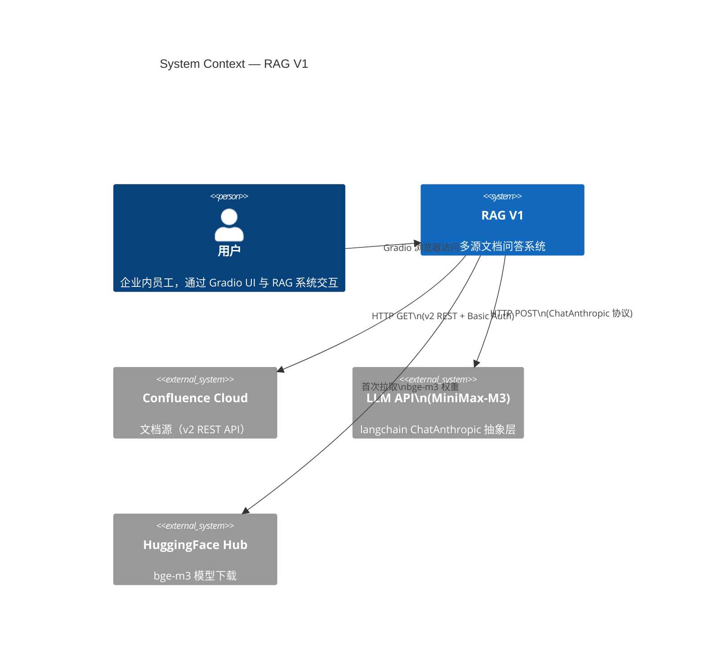
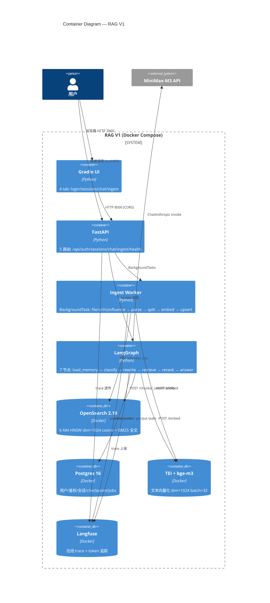
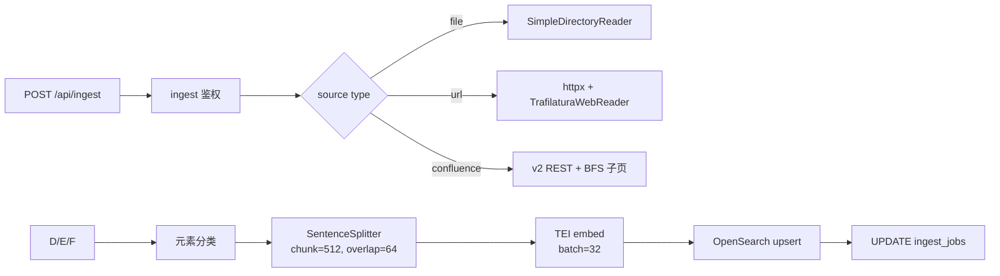
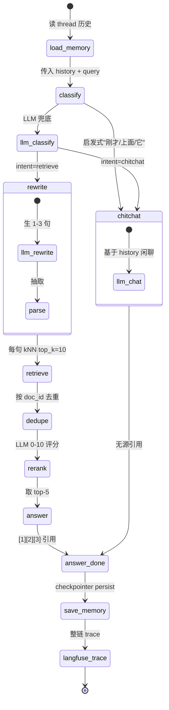
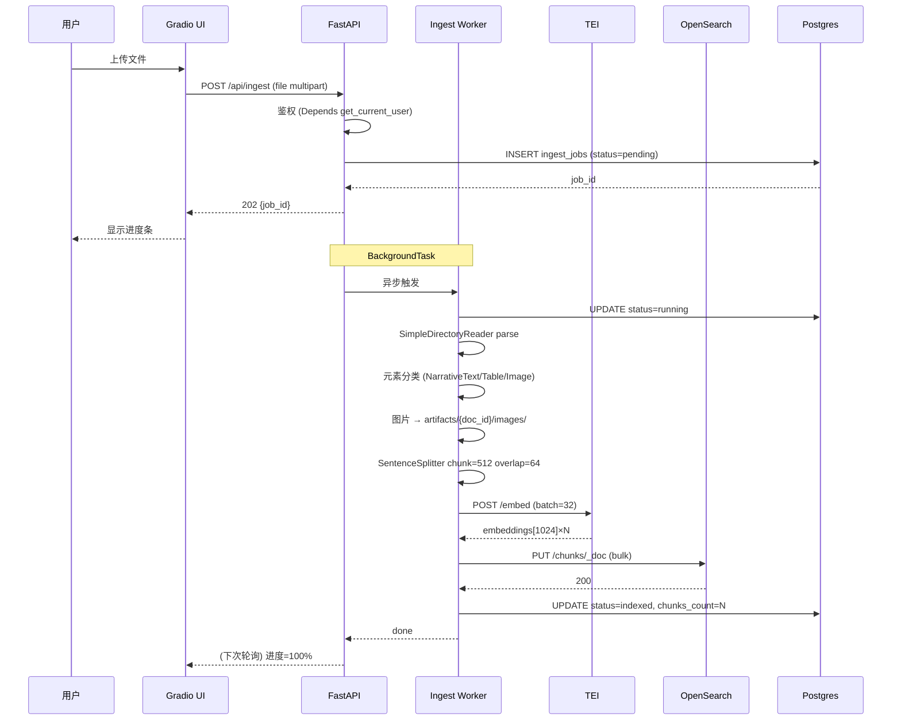
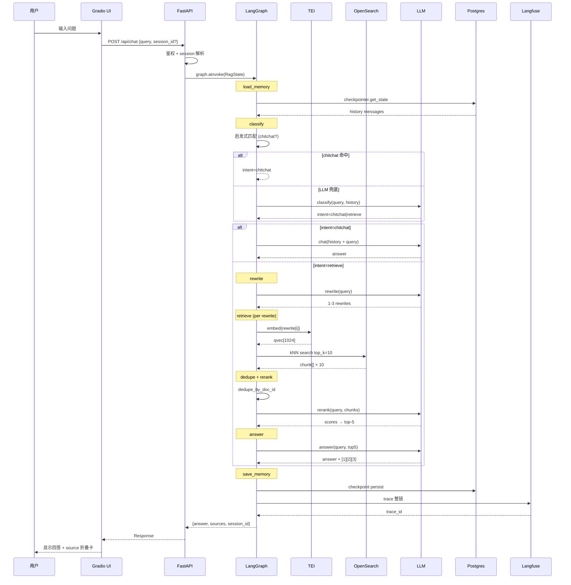
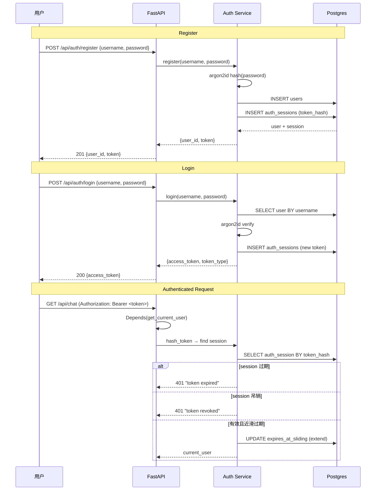
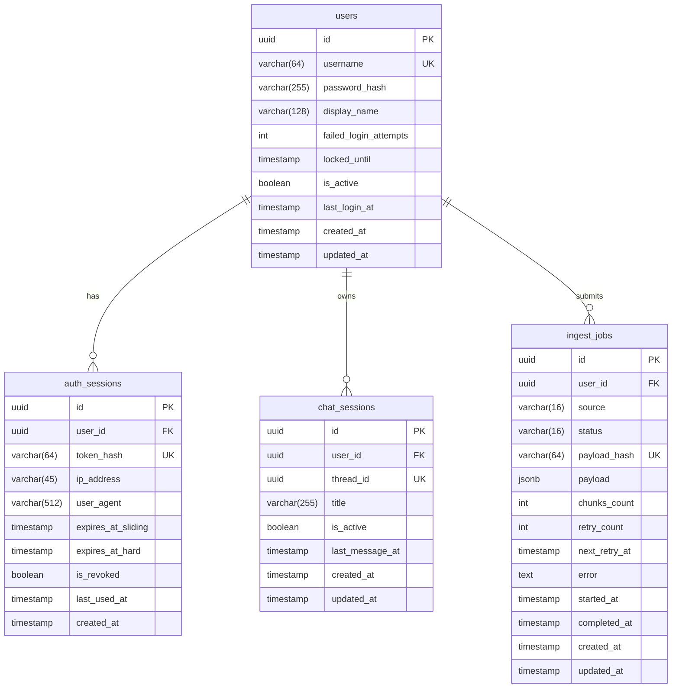

# RAG V1 系统设计文档

> 状态：v2.0（2026-06-11 · 基于 13 份实施 plan + 7 周 review 闭环）
> 关联：[V1 Scope 实施规格](./2026-06-10-rag-v1-scope.md) · [V2 TODO](./2026-06-10-rag-v2-todo.md) · [Plans 目录](../plans/)
> 脑暴基线：session `20260608_145040_7202e5` / `20260608_135459_3ae46d43`

---

## 目录

1. [设计哲学](#1-设计哲学)
2. [C4 架构总览](#2-c4-架构总览)
3. [组件架构](#3-组件架构)
4. [数据流（Mermaid 序列图）](#4-数据流mermaid-序列图)
5. [数据模型](#5-数据模型)
6. [API 契约](#6-api-契约)
7. [安全设计](#7-安全设计)
8. [部署架构](#8-部署架构)
9. [可观测性策略](#9-可观测性策略)
10. [测试与 CI/CD](#10-测试与-cicd)
11. [关键决策与权衡](#11-关键决策与权衡)
12. [性能考量](#12-性能考量)
13. [V1.1 / V2 演进路线](#13-v11--v2-演进路线)

---

## 1. 设计哲学

### 1.1 核心原则

| 原则 | 含义 |
|------|------|
| **三库职责隔离** | LlamaIndex 仅 ingest（Reader + Splitter），langchain 仅 LLM 抽象层，langgraph 仅 query 编排。绝不跨界 |
| **Ingest / Query 解耦** | ingest 走异步 BackgroundTask，query 走同步 LangGraph，中间通过 OpenSearch 松耦合 |
| **配置驱动** | 所有硬编码参数（端口、模型名、超时、重试次数、限速阈值）走 env / Pydantic Settings |
| **降级优先于崩溃** | PG 不可达降级 SQLite、OpenSearch 不可达降级纯 LLM、TEI 超时重试后报 failed |
| **TDD 红绿循环** | 每段代码先有 RED 测试，再写 GREEN 实现，REFACTOR 优化 |
| **观测即基础设施** | Langfuse trace 不是"可有可无的 bonus"，是 M3 工厂级别的强制依赖 |

### 1.2 否决的架构路径

| 否决方案 | 原因 | 替代 |
|----------|------|------|
| 纯 LlamaIndex Agent | 流程控制弱，不适合多步编排（Self-RAG / Corrective RAG） | LangGraph 7 节点 |
| 砍 langchain 直调 SDK | langchain 的 callback 链（Langfuse）、bind 协议、model 抽象在 1.0.8 已成熟 | 保留 langchain ==1.0.8，限定 LLM 抽象层 |
| JWT token | 无状态注销困难、依赖密钥轮转 | 随机 token + SHA-256 哈希 + DB 查表 |
| OpenSearch checkpointer | 写入模式不适合高频 checkpoint、事务/索引压力、官方不支持 | PostgresCheckpointer + SQLite 降级 |
| Milvus 向量库 | 运维复杂、中小规模过度设计 | OpenSearch 2.19（兼顾全文检索 + 向量） |
| Qdrant | spec v0.1-v0.2 评估后认为 OpenSearch 的生态兼容性（全文 + 向量一体）更优 | OpenSearch 2.19 |
| 飞书文档源 | 用户场景 > Confluence Cloud | Confluence Cloud |

---

## 2. C4 架构总览

### 2.1 Level 1 · 系统上下文



### 2.2 Level 2 · 容器视图



### 2.3 Level 3 · 组件模块树

完整模块树见 [V1 Scope §2 模块树](./2026-06-10-rag-v1-scope.md#2-模块树)，此处仅提关键架构分隔：

```
apps/rag_v1/
├── infra/               ← 基础设施层（与代码解耦）
│   ├── docker-compose.yml
│   ├── docker-compose.prod.yml
│   └── backup/
│
├── app/                 ← 应用代码
│   ├── api/             ← 入站层（FastAPI HTTP 适配）
│   ├── auth/            ← 安全层（令牌/密码/注入）
│   ├── db/              ← 持久化层（ORM / 迁移 / session）
│   ├── graph/           ← 编排层（LangGraph workflow）
│   ├── ingest/          ← 接入层（三源 reader + pipeline）
│   ├── retrieval/       ← 检索层（OpenSearch 客户端）
│   ├── memory/          ← 记忆层（checkpointer + thread）
│   ├── llm/             ← 智力层（LLM 工厂 + prompt）
│   ├── embedding/       ← 向量化层（TEI 客户端）
│   ├── observability/   ← 观测层（trace / 装饰器）
│   ├── eval/            ← 评估层（RAGAS CLI / gate）
│   ├── middleware/       ← 中间件层（限速 / CSP / 错误处理）
│   └── ui/              ← 展示层（Gradio 4 tab）
│
├── alembic/             ← 迁移脚本
└── tests/
    ├── unit/            ← 单元测试（mock 一切外部依赖）
    └── integration/     ← 集成测试（真 PG + mock OS/TEI/LLM）
```

---

## 3. 组件架构

### 3.1 API 层（FastAPI）

**职责**：HTTP 适配器，将外部请求转化为内部调用

**设计模式**：
- 每个路由一个 `.py` 文件（auth / sessions / chat / ingest / health）
- `app/api/__init__.py` 聚合 APIRouter
- `app/main.py` 管理 lifespan（compile_workflow 的 async with）
- 请求/响应 Pydantic schema 统一在 `app/api/schemas/`
- exception handler 统一在 `app/middleware/error_handler.py`

**关键配置**：
- 端口 8000（容器内），容器外映射 8000
- CORS：允许 Gradio 7860 + CLI 直接调用
- lifespan：`async with make_checkpointer() as cp: app.state.graph = compile_workflow(cp)`
- Request ID：每个请求 `X-Request-Id` → 透传到 Langfuse trace

### 3.2 Ingest 管线（LlamaIndex）

**职责**：文档接入 → 解析 → 分块 → 嵌入 → 入库

**设计模式**：
- 策略模式：`app/ingest/sources/{file,url,confluence}.py` 各自实现 reader
- 管道模式：`app/ingest/pipeline.py` 编排 `parse → split → embed → upsert`
- 异步任务：FastAPI `BackgroundTasks` 触发，不阻塞请求



**幂等设计**：
- `payload_hash = sha256(source + payload_key + user_id)` → UNIQUE → `ON CONFLICT DO NOTHING`
- 同一 payload 重复提交返回已有 job_id

### 3.3 LangGraph Workflow

**职责**：RAG 查询编排，7 节点 Stateful Graph



**节点函数签名**（伪代码）：

```python
class RagState(TypedDict):
    query: str
    messages: list[BaseMessage]        # history
    intent: Literal["retrieve", "chitchat"]
    rewrites: list[str]                # 1-3 条改写
    chunks: list[Chunk]                # 检索结果
    answer: str                        # 最终回答
    sources: list[Source]              # [1][2][3] 引用
    user_id: str
    thread_id: str
    error: str | None

# 节点函数
async def load_memory_node(state, config) -> RagState
async def classify_node(state) -> RagState
async def query_rewrite_node(state) -> RagState
async def retrieve_node(state) -> RagState
async def rerank_node(state) -> RagState
async def answer_node(state) -> RagState
async def save_memory_node(state, config) -> RagState  # no-op 占位
async def answer_chitchat_node(state) -> RagState

# 条件边
def route_after_classify(state) -> Literal["query_rewrite", "answer_chitchat"]
```

### 3.4 检索层（OpenSearch）

**索引设计**：

```json
PUT /chunks
{
  "settings": {
    "index.knn": true,
    "number_of_shards": 1,
    "number_of_replicas": 0
  },
  "mappings": {
    "properties": {
      "vector": {
        "type": "knn_vector",
        "dimension": 1024,
        "method": {
          "name": "hnsw",
          "space_type": "cosinesimil",
          "engine": "lucene",
          "parameters": { "ef_construction": 128, "m": 16 }
        }
      },
      "text":         { "type": "text", "analyzer": "smartcn" },
      "source":       { "type": "keyword" },
      "doc_id":       { "type": "keyword" },
      "page_id":      { "type": "keyword" },
      "image_ref":    { "type": "keyword" },
      "chunk_index":  { "type": "integer" },
      "created_at":   { "type": "date" }
    }
  }
}
```

**检索流程**：
1. 用户 query → TEIEmbedder → query vector
2. `knn: { vector: qvec, k: top_k }` → 10 hits
3. 按 doc_id dedupe（保留高分 chunk）
4. 返回 `list[Chunk]`

**降级路径**：OpenSearch 不可达 → answer 走纯 LLM 兜底，无源引用。

### 3.5 Embedding 服务（TEI + bge-m3）

- 部署：`ghcr.io/huggingface/text-embeddings-inference:1.5`
- 模型：`BAAI/bge-m3`（dim=1024）
- 模式：CPU 起步（生产可切 GPU）
- 批处理：`batch_size=32`，总超时 60s
- 错误处理：5xx → tenacity 指数退避 3 次（1s/2s/4s），4xx → 立即失败
- 维度断言：embed 返回 `len(vector) != 1024` → 抛 `EmbeddingDimensionMismatch`

### 3.6 LLM 抽象层（langchain ChatAnthropic）

```python
# app/llm/factory.py
def make_llm(node: str) -> ChatAnthropic:
    cfg = load_prompt(node)
    llm = ChatAnthropic(
        model=cfg.model,              # "minimax-cn/MiniMax-M3"
        temperature=cfg.temperature,   # classify=0.0, rewrite=0.3, rerank=0.0, answer=0.5
        max_tokens=cfg.max_tokens,
        api_key=settings.llm.api_key.get_secret_value(),
        timeout=settings.llm.timeout,  # 60s
    )
    handler = get_callback_handler()
    if handler:
        llm = llm.with_config({"callbacks": [handler]})
    return llm
```

**已注册节点**：`classify` / `rewrite` / `rerank` / `answer` / `chitchat` / `judge`

### 3.7 鉴权系统

- **密码**：argon2id（`time_cost=3, memory_cost=65536`，OWASP 2024）
- **Token**：`secrets.token_urlsafe(32)` → 客户端明文 / DB SHA-256 哈希
- **双过期**：7 天滑动上限（每次请求自动续期）+ 30 天硬上限
- **限速**：register 5/min/IP，login 10/min/IP（`slowapi`）
- **注销**：软删除 `auth_sessions`（`is_revoked=True`），不删除行
- **越权保护**：session_id 不属于 current_user → 404（不暴露存在性）
- **密码校验**：长度 ≥ 8，含大小写字母 + 数字

### 3.8 持久化层（Postgres + Alembic）

ER 图见 [§5 数据模型](#5-数据模型)。

关键设计：
- async engine：`create_async_engine()` + `async_sessionmaker`
- 连接池：`pool_size=10, max_overflow=20, pool_recycle=3600`
- connection pool 兼容 pgbouncer：`statement_cache_size=0`
- Alembic migration：`alembic upgrade head` 用 `pg_advisory_lock` 防并发
- `Index(... postgresql_concurrently=True)` 生产加索引不锁表

### 3.9 前端（Gradio 5.0+）

4 tab 分离：
- **Login**：注册/登录表单，成功后跳 sessions
- **Sessions**：`gr.Dataframe` 列表 + 新建/删除/切换按钮
- **Chat**：`gr.Chatbot(type="messages")` + 输入框 + source 折叠卡 + image 缩略图
- **Ingest**：3 个嵌套 `gr.Tab`（file upload / URL 4-auth / Confluence page）

关键约束：
- 主题：暗色 `#0d1117` + `#58a6ff` + PingFang SC / Microsoft YaHei
- 端口 7860
- 与 FastAPI CORS 配合：`http://localhost:8000`

### 3.10 观测（Langfuse）

双轨观测：
- **在线**：Langfuse trace（LLM call + 节点级 + ingest pipeline）
- **离线**：RAGAS CLI（golden set 20-50 题）

trace 结构：
```
RAGQuery:{trace_id}
├── auth (user_id, session_id)
├── load_memory (history_len, thread_id)
├── classify (intent, confidence)
├── query_rewrite (n_rewrites)
├── retrieve (n_chunks, n_docs)
├── rerank (top_score)
├── answer (token_count, citation_count)
└── save_memory (checkpoint_ok)
```

PII 脱敏：password / token 值 → `***` 入 trace metadata。

### 3.11 评估（RAGAS）

- CLI 入口：`python -m app.eval.ragas_run`
- 指标：faithfulness、answer_relevancy、context_precision
- Judge LLM：强制注入 `make_llm("judge")`，不从 env 读 OpenAI key
- CI 门禁：faithfulness < 0.7 → exit code 1
- Golden set：20 题（CI）/ 50 题（nightly），JSONL 格式 git 化

### 3.12 中间件层（M12 Hardening）

挂载顺序：`RateLimit → SecurityHeaders → RequestID → CORSMiddleware → Auth`

实现：
- `app/middleware/rate_limit.py`：chat 30/min/user，ingest 10/min/user，health bypass
- `app/middleware/security_headers.py`：CSP (script-src 'self' 'unsafe-inline') / HSTS / XFO
- `app/middleware/error_handler.py`：11 条错误矩阵统一处理

---

## 4. 数据流（Mermaid 序列图）

### 4.1 Ingest 流程（以 file 为例）



### 4.2 Query 流程



### 4.3 Auth 流程



---

## 5. 数据模型

### 5.1 ER 图



### 5.2 索引策略

| 表 | 索引 | 理由 |
|---|---|---|
| `users` | `username` (UNIQUE) | 登录查询 |
| `users` | `email` (UNIQUE) | 密码找回 |
| `auth_sessions` | `token_hash` (UNIQUE) | 鉴权查询 |
| `auth_sessions` | `(user_id, expires_at_hard)` | session 清理 |
| `auth_sessions` | `(user_id, expires_at_sliding)` | 按用户查活跃 session |
| `chat_sessions` | `thread_id` (UNIQUE) | LangGraph checkpointer |
| `chat_sessions` | `(user_id, is_active, updated_at DESC)` | session 列表 |
| `ingest_jobs` | `payload_hash` (UNIQUE) | 幂等 |
| `ingest_jobs` | `(user_id, created_at DESC)` | 用户查询任务 |
| `ingest_jobs` | `(status, created_at)` | Worker 轮询待办 |
| `ingest_jobs` | `(next_retry_at)` | 重试调度 |

### 5.3 LangGraph Checkpointer 表

由 `langgraph-checkpoint-postgres` 自动管理（`checkpoints` / `checkpoint_writes` / `checkpoint_blobs`），不在 4 张核心表内。V1 仅保证 thread_id 与 `chat_sessions.thread_id` 关联的读/写一致性。

---

## 6. API 契约

### 6.1 端点总表

| 方法 | 路径 | 鉴权 | 请求体 | 响应 |
|------|------|------|--------|------|
| POST | `/api/auth/register` | 无 | `RegisterRequest` | `UserResponse` (201) |
| POST | `/api/auth/login` | 无 | `LoginRequest` | `TokenResponse` |
| POST | `/api/auth/logout` | Bearer | `LogoutRequest` | 204 |
| GET | `/api/sessions` | Bearer | — | `list[SessionResponse]` |
| GET | `/api/sessions/{id}` | Bearer | — | `SessionDetailResponse` |
| POST | `/api/chat` | Bearer | `ChatRequest` | `ChatResponse` |
| POST | `/api/ingest` | Bearer | `IngestRequest` (multipart) | `IngestResponse` (202) |
| GET | `/api/ingest/{job_id}` | Bearer | — | `IngestProgressResponse` |
| GET | `/api/health` | 无 | — | `HealthResponse` |

### 6.2 关键 Schema

```python
# ChatRequest
{
    "query": "去年 Q3 各业务线营收对比",  # required, 1-2000 chars
    "session_id": "uuid-string" | None   # 缺 = 新会话
}

# ChatResponse
{
    "answer": "根据文档，2024年Q3... [1][2][3]",
    "sources": [
        {
            "chunk_id": "uuid",
            "doc_id": "uuid",
            "image_ref": "artifacts/doc123/images/fig1.png" | None,
            "score": 8.5
        }
    ],
    "session_id": "uuid-string",
    "trace_id": "langfuse-trace-id"
}

# IngestRequest (multipart: 文件上传 / JSON body)
# file 模式:
{
    "source": "file",
    "files": [...multipart...]
}
# url 模式:
{
    "source": "url",
    "urls": ["https://..."],
    "auth_type": "bearer" | "basic" | "cookie" | "header",
    "auth_value": {...}
}
# confluence 模式:
{
    "source": "confluence",
    "base_url": "https://xxx.atlassian.net",
    "page_id": "123456",
    "max_depth": 5
}
```

---

## 7. 安全设计

### 7.1 鉴权模型

```
客户端                   服务端
  │                       │
  │  register/login       │ argon2id 校验
  │──────────────────────>│ 生成 32B token
  │  200 {token}          │ SHA-256 存 DB
  │<──────────────────────│
  │                       │
  │  /api/chat            │ hash(token) → 查 auth_sessions
  │  Authorization: Bearer│ 校验双过期 + is_revoked
  │──────────────────────>│ 滑过期近限自动续期
  │  200 {answer}         │
  │<──────────────────────│
```

### 7.2 SSRF 防护（URL Ingest）

URL 源强制白名单：
- 拒绝：`127.0.0.1` / `localhost` / `10.0.0.0/8` / `172.16.0.0/12` / `192.168.0.0/16` / `::1` / `::ffff:0:0` mapped IPv4 / `169.254.0.0/16`
- DNS 解析后校验（防 DNS rebinding）
- 302 跟随后**二次校验**（防 redirect bypass）
- 拒绝非 http/https 协议（`file://` / `ftp://` / `dict://`）

### 7.3 PII 脱敏

Langfuse trace metadata 和日志中：
- `password` / `secret` / `token` / `api_key` → `***`
- `.env` 中所有密码值用 `[REDACTED]` 标注
- `__repr__` 中 `AuthConfig` / `ApiToken` 类不输出 password/token 明文

### 7.4 CSP 头

```
Content-Security-Policy:
  default-src 'self';
  script-src 'self' 'unsafe-inline';   # Gradio 5.0+ 需要 inline
  style-src 'self' 'unsafe-inline';
  img-src 'self' data:;
  font-src 'self';
  connect-src 'self' http://localhost:8000;  # Gradio → FastAPI
```

### 7.5 限速

| 端点 | 限速 | 依据 |
|------|------|------|
| `POST /api/auth/register` | 5/min/IP | 防批量注册 |
| `POST /api/auth/login` | 10/min/IP | 防暴力破解 |
| `POST /api/chat` | 30/min/user | 防滥用 |
| `POST /api/ingest` | 10/min/user | 系统容量 |
| `GET /api/health` | 不限 | 健康检查 |

---

## 8. 部署架构

### 8.1 开发环境

```yaml
# docker-compose.yml (dev)
services:
  postgres:      16-alpine        port 5432
  opensearch:    2.19             port 9200
  tei:           1.5 (bge-m3)    port 18080
  langfuse:      2                port 3000
  gradio:        app/ui/          port 7860
  fastapi:       app/main.py      port 8000
```

单 bridge 网络：`rag_net`，service name DNS 互通。

### 8.2 生产环境变更

- 容器不暴露 host port（仅内部通信）
- env 从 secret manager 注入（非 `.env` 文件）
- volumes 用命名 volume + 定期备份
- 资源限制：postgres 512M / OS 2G / TEI 4G / langfuse 1G
- `docker-compose.prod.yml` override

### 8.3 备份策略

- **Postgres**：每日 `pg_dump` + WAL 归档（每 30 分钟）
- **OpenSearch**：每日 snapshot + S3 兼容存储（MinIO）
- **恢复演练**：每月 restore.sh 演练（staging 环境）
- **artifacts**（图片）：host volume 定期 rsync

---

## 9. 可观测性策略

### 9.1 指标三支柱

| 支柱 | 工具 | 覆盖 |
|------|------|------|
| Trace | Langfuse | 每个 LLM call + 节点 + ingest pipeline |
| Log | structlog (JSON → stdout) | 全部请求 + 错误 + 降级 |
| Alert | Sentry (M12) | 5xx 异常、faithfulness 下降 |

### 9.2 Langfuse Trace 结构

```
QUERY:{trace_id}
├─ metadata
│  ├─ user_id
│  ├─ session_id / thread_id
│  ├─ request_id
│  └─ app_version
├─ span: classify
│  ├─ name: classify.llm / classify.heuristic
│  ├─ input: query
│  └─ output: intent
├─ span: rewrite
│  ├─ input: query
│  └─ output: rewrites[]
├─ span: retrieve (×N)
│  ├─ input: qvec
│  ├─ output: chunks, metadata
│  └─ usage: token_count
├─ span: rerank
│  ├─ input: chunks[]
│  ├─ output: top5
│  └─ usage: token_count
└─ span: answer
   ├─ input: top5 + query
   ├─ output: answer + sources
   └─ usage: token_count, cost_usd
```

### 9.3 RAGAS 离线评估

`python -m app.eval.ragas_run --golden-set fixtures/golden_set_v1.jsonl --metrics faithfulness,answer_relevancy,context_precision --threshold 0.7`

输出：JSON 明细 + HTML 报告 + exit code（gate 失败 = 1）。

---

## 10. 测试与 CI/CD

### 10.1 测试金字塔

```
        ╱╲
       ╱  ╲         RAGAS Golden Set (20 题, CI)
      ╱    ╲
     ╱ E2E  ╲       test_m7_e2e / test_m8_e2e / test_m9_e2e
    ╱ ────── ╲      (真 PG + mock LLM + mock OS)
   ╱ Integration╲    test_m{0-12}_*.py (需要 docker)
  ╱ ──────────── ╲
 ╱   Unit Tests   ╲  pytest tests/unit/ (全 mock, <10s)
╱──────────────────╲
```

### 10.2 TDD 红绿流程

```
RED   写测试 → 跑测试 → 失败（预期）
GREEN 写实现 → 跑测试 → 通过
       commit [GREEN]
REFACTOR 重构 → 跑测试 → 仍通过
       commit [RF]
```

基础设施（docker-compose / init.sql / README）直接 GREEN，不强制 RED。

### 10.3 CI 门禁（GitHub Actions）

```
名称: ci.yml
触发: pull_request (main)
步骤:
  1. lint (ruff)
  2. unit test (pytest tests/unit/)
  3. docker compose up (M0 infra)
  4. integration test (pytest tests/integration/)
  5. RAGAS gate (20 题, faithfulness ≥ 0.7)
       → 超时 30 分钟
       → 失败 = exit code 1, block merge
  6. coverage report (--cov-fail-under=80)
```

```
名称: nightly-ragas.yml
触发: cron (daily 02:00)
步骤:
  1. RAGAS full eval (50 题)
  2. 结果写入 JSON + HTML
  3. 失败 → PagerDuty 告警
```

---

## 11. 关键决策与权衡

### 11.1 决策总表

| # | 决策 | 选择 | 备选（否决理由） | 影响 |
|---|------|------|-------------------|------|
| 1 | 主框架 | LangGraph (StateGraph) | 纯 LlamaIndex Agent（流程控制弱） | 多节点编排 OK |
| 2 | LLM 抽象 | langchain 1.0.8 | 裸 SDK（缺 Langfuse callback 链） | 观测黑盒 → 透明 |
| 3 | 向量库 | OpenSearch 2.19 | Qdrant（生态兼容弱）、Milvus（运维重） | 全文+向量一体 |
| 4 | Embedding | TEI + bge-m3 自部署 | OpenAI embedding（数据外泄） | 完全可控 |
| 5 | Token | 随机 32B + SHA-256 | JWT（无状态注销难） | DB 查表复杂度 O(1) |
| 6 | Password | argon2id tc=3 mc=65536 | bcrypt 12 rounds（GPU 抗性差） | 登录延迟 ~100ms |
| 7 | Checkpointer | Postgres + SQLite 降级 | OpenSearch checkpointer（写入模式不匹配） | 两库不混用 |
| 8 | Ingest | LlamaIndex Reader | langchain DocumentLoader（生态深不如 LlamaIndex） | 三源统一管线 |
| 9 | Confluence auth | Cloud Basic (email + API token) | OAuth 2.0（V1 不做 SSO） | 兼容所有 Cloud 实例 |
| 10 | URL auth | 4 模式配置化 | 仅 bearer（不满足企业需求） | 4 模式可扩展 |
| 11 | API | FastAPI | Flask（异步支持弱） | async graph.invoke |
| 12 | UI | Gradio 5.0 | React（前端开发成本高） | Python 全栈 |

### 11.2 版本范围决策

langchain==1.0.8 / langgraph==1.0.5 / llama-index==0.14.8 精确 pin（共 7 包），其余 29 包使用 `>=,<` 区间。精确 pin 的原因：
- langchain 1.1+ 有重大 API 变更（runnables chain 不兼容）
- langgraph 1.1+ 改为 `add_sequence` 替换 `add_edge` 模式
- llama-index 0.14→0.15 索引 API 变更

---

## 12. 性能考量

### 12.1 估算

| 场景 | 估算 | 备注 |
|------|------|------|
| Ingest file (100 pages PDF) | ~30s | parse 5s + split 1s + embed 10s + upsert 5s |
| Ingest url (单页) | ~5s | fetch 2s + parse 1s + split+embed+upsert 2s |
| Ingest confluence (10 page) | ~60s | API 5 reqs + 同上 |
| Query (classify → answer) | ~8s | LLM×4 (3+1+2+2s) + embed 1s + search 0.5s |
| Query chitchat | ~3s | LLM×1 |
| RAGAS CI 20 题 | ~5min | 每题 ~15s |
| Full RAGAS 50 题 | ~15min | + golden set 生成 |

### 12.2 瓶颈

- **LLM 延迟**：4 次连续 LLM 调用占总查询时间的 90%+。V2 引入 streaming（SSE）+ 缓存 reduce
- **TEI 冷启动**：bge-m3 模型加载 30-60s（`docker compose pull tei` 预热）
- **OpenSearch 首次索引**：HNSW 图构建在初次 upsert 时有额外延迟（20s+ for 10k chunks）
- **Confluence API 限速**：Cloud 实例通常 100 req/min，semaphore(5) + 退避控制

### 12.3 优化方向（V2）

- hybrid search（BM25 + vector）→ 召回率提升 10-15%
- 专用 reranker（Cohere / bge-reranker）→ 替代 LLM rerank，延迟降 80%
- SSE 流式 → 首 token 时间降 80%
- LLM response 缓存 → 重复 query 命中率 60%+

---

## 13. V1.1 / V2 演进路线

（完整清单见 [V1.1 TODO](../plans/../specs/2026-06-08-rag-v1.1-todo.md) / [V2 TODO](../plans/../specs/2026-06-08-rag-v2-todo.md)）

### V1.1（V1 发布后 4-6 周）

- Confluence 整 space CQL 抓取（mode=space）
- Confluence 增量同步（webhook 优先）
- Confluence 页面版本切换
- Confluence 评论纳入检索
- URL reader: Playwright 后端（JS 渲染）
- classify 双轨 telemetry

### V2（V1.1 发布后 6-12 周）

- Hybrid search（BM25 + dense）
- Cohere / bge-reranker 替代 LLM rerank
- 流式响应 SSE
- 多模态 VLM（CLIP / Claude vision）
- 图片内容问答
- 多租户 + doc 级 ACL
- SSO（PingOne / Okta / Auth0）
- MFA / TOTP
- A/B 实验框架
- 用户反馈闭环
- Fine-tune 闭环
- Prometheus + Sentry
- Snowball 增量同步

---

## 修订记录

| 版本 | 日期 | 改动 |
|------|------|------|
| v2.0-r0 | 2026-06-11 | 完整系统设计：重写所有 Mermaid 图、数据模型、API 契约、安全设计、性能分析、决策总表 12 项 + 否决记录。基于 13 份实施 plan + 10 份 review。 |
